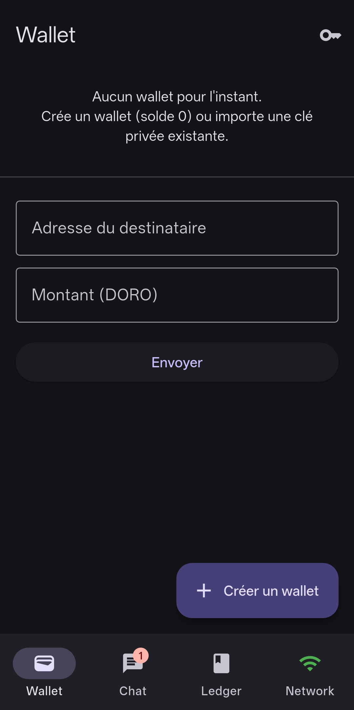
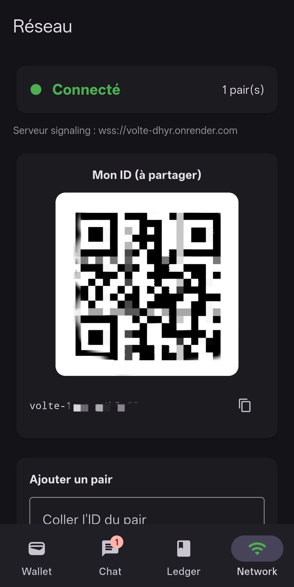
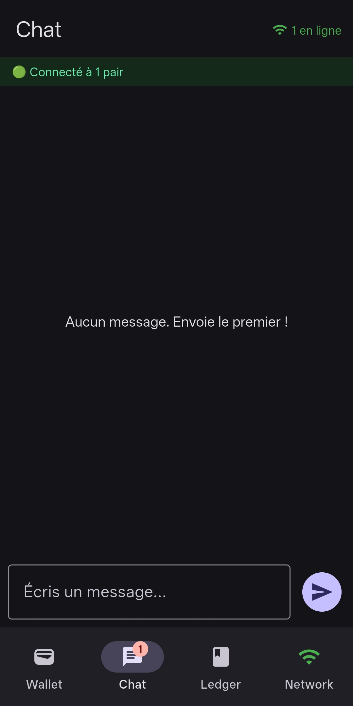
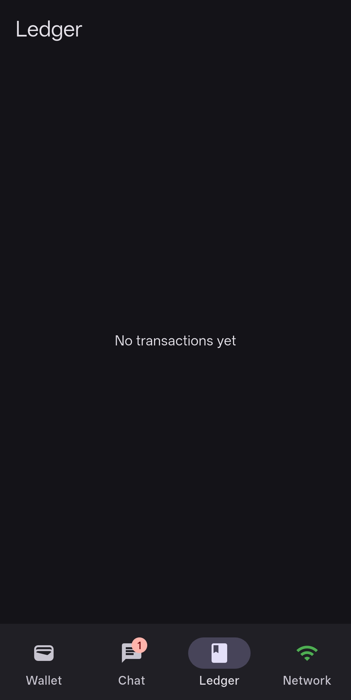

<p align="center">
  
  
  
  
</p>

<h1 align="center">⚡ DORO PROTOCOL</h1>
<p align="center"><strong>Réseau décentralisé P2P — Communications et Registre distribué.</strong></p>

---

# 🚀 TESTER LE RÉSEAU (LIVE SIMULATOR)
> **MODE EXPERT : Simulation de stress-test multi-nœuds.**

<p align="center">
  <a href="https://connacri.github.io/Doro/">
    
  </a>
</p>

<div align="center">

## 🚀 [LANCER LE SIMULATEUR LIVE : connacri.github.io/Doro/](https://connacri.github.io/Doro/)

[](#)
[](#)

</div>

Pour tester la résilience du protocole Doro sans installer Flutter, utilisez notre **Network Testbed** (simulateur Web haute fidélité).

**Ce que vous pouvez tester immédiatement :**
- 🟢 **Multi-nœuds :** Ajoutez des dizaines de pairs et observez la propagation du Ledger.
- 💬 **Auto-Chat :** Forcez les nœuds à saturer le réseau de messages cryptés.
- 💸 **Stress-Test TX :** Déclenchez des vagues de transactions pour tester le TPS.
- 📉 **Chaos Engine :** Coupez la connexion d'un nœud et voyez comment il se désynchronise du DAG.

---

## ✨ Fonctionnalités

 Module | Description |
--------|-------------|
 🌐 **P2P Engine** | Connexion WebRTC directe entre pairs, simulation de latence et de perte de paquets |
 🆔 **Identité persistante** | Un ID stable Ed25519 par appareil (généré une seule fois) |
 📷 **Ajout de pairs** | Scan de QR code ou collage d'ID pour ajouter un contact |
 🔐 **Chiffrement** | Signatures Ed25519 réelles |
 🗣️ **Gossip v2** | Protocole de diffusion intelligente avec déduplication et TTL |
 📋 **DAG Ledger** | Registre distribué avec validation locale indépendante par pair |
 ✅ **Consensus** | BFT avec vote pondéré et score de réputation |
 💰 **Wallet** | Portefeuille natif (DoroCoin) avec solde local |
 💬 **Chat** | Messagerie instantanée P2P via WebRTC |
 🛠️ **Chaos Lab** | Outils de torture réseau (partitions, déconnexions, latence variable) |

## 📸 Aperçu

<p align="center">
  
  
  
  
</p>

---

## 🛠️ Installation & Build

### 1. Simulateur Web (Rapide)
Ouvrez simplement le fichier `index.html` à la racine du projet ou accédez à la version hébergée via le bouton ci-dessus.

### 2. Application Flutter (Android/Windows)
```bash
# Prérequis
flutter --version  # 3.44.0+

# Dépendances
flutter pub get

# Lancement en dev
flutter run

# Build signé
flutter build apk --release
```

---

## 📐 Architecture du Réseau
Chaque nœud dans Doro est **totalement souverain**. Il possède :
1. Sa propre base de données de messages.
2. Sa propre instance du DAG (Ledger).
3. Son propre moteur de consensus.

Il n'y a **aucune source de vérité centrale**. La vérité est ce que la majorité des nœuds honnêtes ont validé via le protocole de Gossip.

---

<p align="center">
  <sub>Built with ❤️ using Flutter, WebRTC, Ed25519 & DAG Consensus</sub>
  <br>
  <sub>Built for scale. Tested for chaos. 🛡️</sub>
</p>
